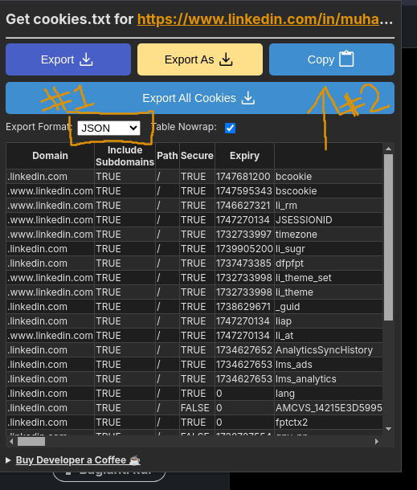
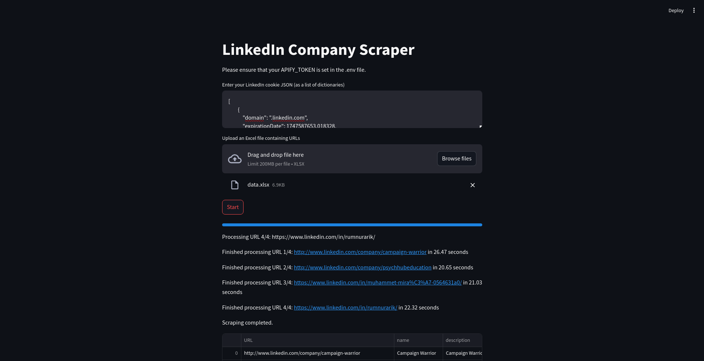
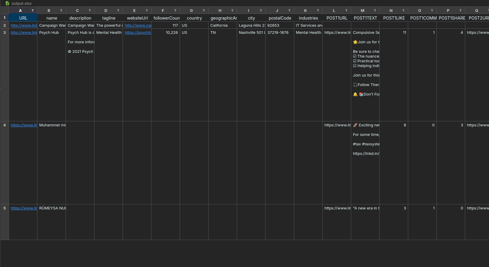

# LinkedIn Scraper with Apify

This project is a LinkedIn scraper that utilizes Apify to extract company and profile data from LinkedIn. It includes a Streamlit application that provides an interactive interface for users to input their LinkedIn cookies, upload an Excel file with LinkedIn URLs, and scrape the data accordingly.

## Table of Contents

- [Features](#features)
- [Installation](#installation)
- [Usage](#usage)
- [Requirements](#requirements)

## Features

- **Interactive Streamlit App:** User-friendly interface to input LinkedIn cookies and upload Excel files.
- **Data Extraction:** Scrapes company and profile data from LinkedIn, including posts.
- **Data Export:** Allows users to download scraped data in Excel format.
- **Progress Monitoring:** Displays progress and runtime information during scraping.
- **Error Handling:** Provides clear error messages in English for any issues encountered.

## Installation

### Clone the Repository

```bash
git clone https://github.com/miracyuzakli/linkedin-scraper-with-apify.git
cd linkedin-scraper-with-apify
```

### Install Requirements

Ensure you have Python 3.6 or higher installed. Install the required packages using `pip`:

```bash
pip install -r requirements.txt
```

## Usage

### Setting Up Environment Variables

Create a `.env` file in the project directory and add your Apify token:

```
APIFY_TOKEN=your_apify_token_here
```

### Running the Streamlit Application

Run the Streamlit app using the following command:

```bash
streamlit run app.py
```

### Using the Application

1. **Enter LinkedIn Cookie JSON:**
   - Paste your LinkedIn cookie in JSON format (as a list of dictionaries) into the text area provided.

    Extention url: https://chromewebstore.google.com/detail/get-cookiestxt-locally/cclelndahbckbenkjhflpdbgdldlbecc

    After installing the extension, you will open the extension by logging in to your linkedin page.

    First of all, we will select the `Export Format` value as `JSON` and then we will copy the cookie value to the specified place in the interface by clicking the `COPY` button.

    

   
2. **Upload Excel File:**
   - Upload an Excel file (`.xlsx`) containing a column named `URL` with the LinkedIn profile or company URLs you wish to scrape.

3. **Start Scraping:**
   - Click the **Start** button to begin the scraping process.

4. **Monitor Progress:**
   - The application will display the progress of scraping, including which URL is being processed and the runtime.

5. **Download Data:**
   - Once scraping is complete, you can download the scraped data as an Excel file by clicking the **Download data as Excel** button.

## Requirements

- Python 3.6 or higher
- Required Python packages (listed in `requirements.txt`):
  - `streamlit`
  - `apify-client`
  - `pandas`
  - `openpyxl`
  - `python-dotenv`
- Valid Apify API token
- LinkedIn account and corresponding cookies


### Exaple ScreenShoots






